# Creating a CI/CD Pipeline for deployment to IBM Cloud Kubernetes Cluster using Jenkins

## Overview

In this lab you will connect your Git repository of the `PetClinic` sample application to a Continuous Integration/Continuous Deployment pipeline built with Jenkins that will deploy to a IBM Cloud Kubernetes Service cluster.

## Setup

Before you start the lab,

1. Login in your Github account in a browser. Register a Git account at [github](https://github.com), if you don't have one already.

1. Open a new tab in the same browser and go to url `https://github.com/lee-zhg/petclinic-java-k8s`.

1. Click on the Fork icon.

   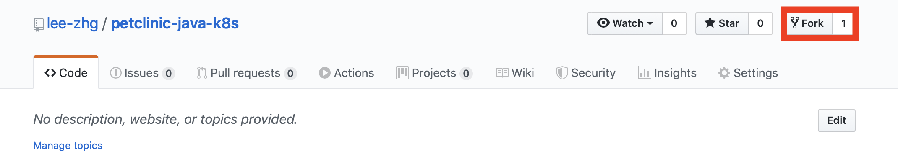

   > Note: you need to fork the repo to have full access to turn of Git WebHooks feature for the repo in later section.

## Lab Steps

CI/CD pipeline with Jenkins to automate application deployment to IBM Kubernetes cluster.

### Step 1: Set up the CI/CD pipeline

In this section, you will connect your cloned Git repo of [this app](https://github.com/lee-zhg/petclinic-java-k8s) to set up a Continuous Integration/Continuous Deployment pipeline built with Jenkins. This pipeline contains 4 main steps as follows:

  | Stage                         | Purpose                                                                        |
  | ----------------------------- | ------------------------------------------------------------------------------ |
  | Build Application ear File    | Pulls in dependencies from Maven and packages application into .ear file       |
  | Build Docker Image            | Builds the Docker image based on the Dockerfile                                |
  | Push Docker Image to Registry | Uploads the Docker image to the Docker image registry within IBM Cloud         |
  | Deploy New Docker Image       | Updates the image tag in the Kubernetes deployment triggering a rolling update |

More details of this pipeline can be found in the [Jenkinsfile](https://raw.githubusercontent.com/lee-zhg/petclinic-java-k8s/master/Jenkinsfile.ext).

1. Log into Jenkins using the URL and the credentials provided to you by your instructor.

1. A pipeline should have already been created for you.

   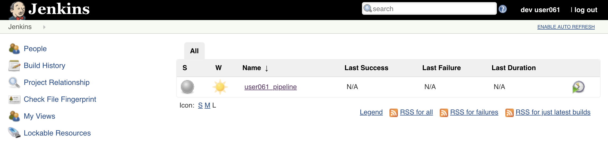

1. Click on your pipeline to open it and then click on the `Configure` link in the navigation area at the left to change it's properties

1. Scroll down to the `Build Trigger` section and select `GitHub hook trigger for GIT SCM polling`

   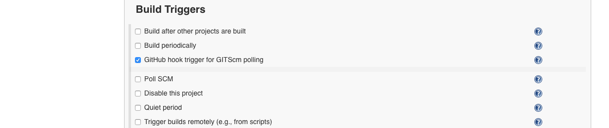

1. Scroll down to the `Pipeline` section and find the `Definition` drop down menu. Select `Pipeline script from SCM`

1. Select `Git` for `SCM` field.

1. In the `Repository URL` field, enter the url to the cloned repository that you forked earlier (i.e. `https://github.com/[your Git username]/petclinic-java-k8s`).

1. Change the `Script Path` to `Jenkinsfile.ext`

   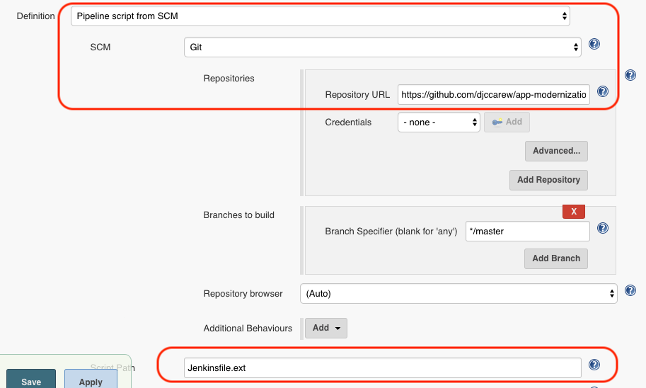

1. Click `Save`.

### Step 3: Manually trigger a build to test pipeline

1. In Jenkins UI, in the navigation area on the left click on `Build with Parameters`.

1. Accept the defaults of all parameters and click on `Build`.

1. To see the console output, click on the build number in the `Build History` and then select on `Console Output`.

   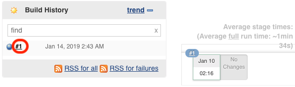

1. If the build is successful, the end of the console output should look like the following:

   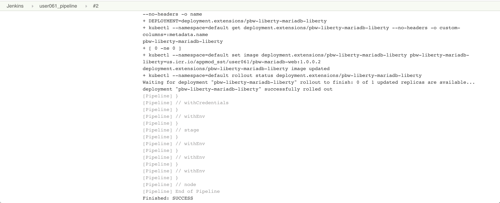

   The Stage View of the pipeline should look like the following:
   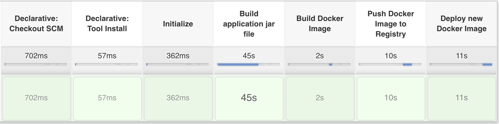

### Step 4: Trigger a build via a commit to Github

Now you'll configure Github to trigger your pipeline whenever code is committed.

1. Go back to Github UI and find your cloned repository

1. Click on the repository `Settings`.

   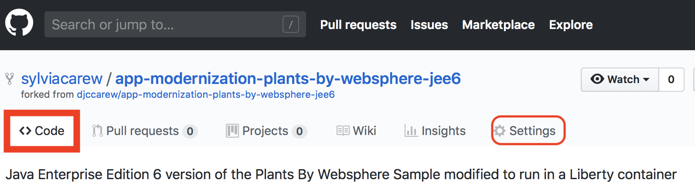

1. Under `Options`, select `Webhooks` on the left.

1. Click `Add webhook`.

   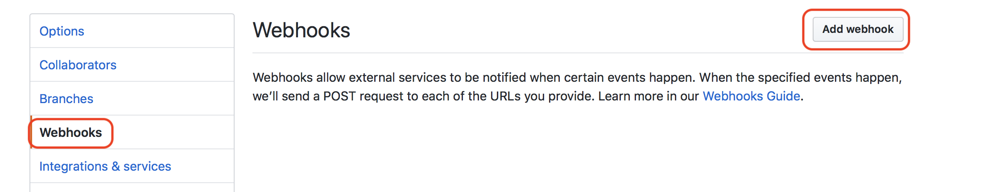

1. For the `Payload URL`, enter `<Jenkins URL>/github-webhook/`  where `<Jenkins URL>` is the URL you used  to login to Jenkins (**Note** Don't forget the trailing `/`).

1. Change the `content type` to `application/json`.

1. Accept the other defaults and click `Add webhook`.

   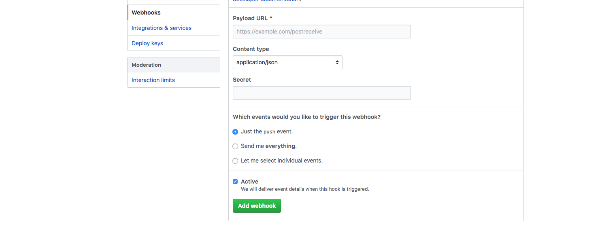

1. The `Webhoods` of you Git repo has been configured properly.

1. In your Git repo, navigate to the `Code` tab on the top.

   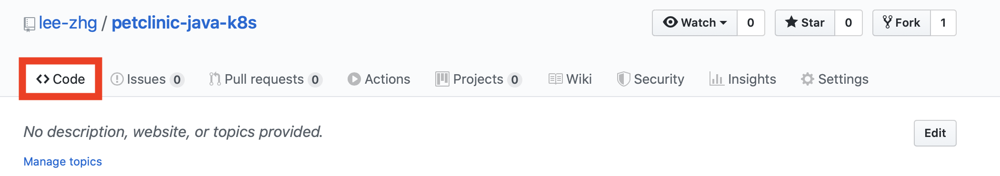

1. In the Github file browser, drill down to `src/main/resources/messages/messages.properties`.

1. Click on the pencil icon to edit file `messages.properties`.

1. Change line 1 from

   ```text
   welcome=Welcome
   ```

   to

   ```text
   welcome=Welcome to the IKS PetClinic
   ```

1. At the bottom of the window, add a commit message and click on `Commit changes`.

1. Your code commit kicks off the CI/CD pipeline.

1. Switch back to Jenkins and open the same pipeline.

1. Verify that your pipeline was started.

1. When the pipeline finishes deployment, you are ready to test the sample application. To test the application, you need IP addess and port#.

1. To identify the `port#` where the sample application is running, run the following command

   ```console
   kubectl get service petclicnic -o jsonpath='{.spec.ports[0].nodePort}' --namespace default
   ```

1. To identify `IP address` where the sample application is running, run the following command

   >If you don't have the $USERNAME environment variable in the command set, replace $USERNAME with your lab user id.

   ```bash
   ibmcloud ks workers <your IKS cluster> | grep -v '^*' | egrep -v "(ID|OK)" | awk '{print $2;}' | head -n1
   ```

1. Your sample application's URL is the combination of the IP address and the port number. For example if your external IP is `169.61.73.182` and the port is `30961` the URL will be `http://169.61.73.182:30961`.

1. Access the application via the URL.

   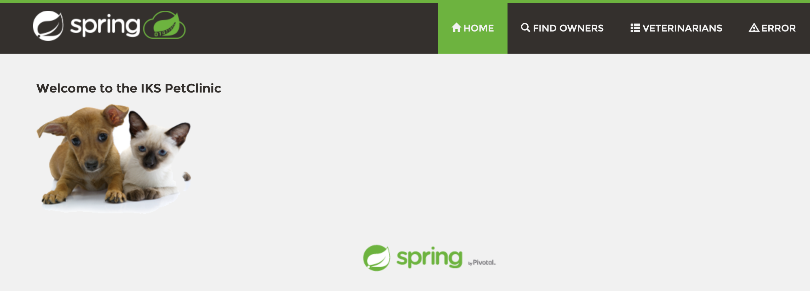

## Cleanup

Free up resources for subsequent labs by deleting the Petclinic application.

1. Run the following command to delete the app

   ```console
   kubectl delete -f https://raw.githubusercontent.com/lee-zhg/petclinic-java-k8s/master/deployment.yaml
   kubectl delete -f https://raw.githubusercontent.com/lee-zhg/petclinic-java-k8s/master/service.yaml
   ```

## Summary

You created a Jenkins pipeline to automatically build and deploy an application that has been updated in Github.
